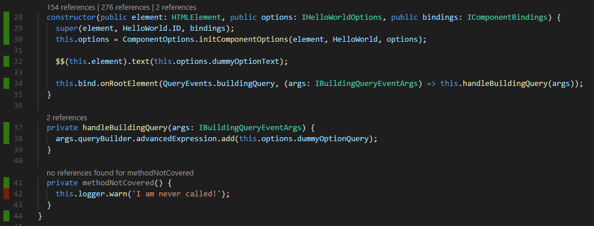

# search-ui-seed
A fast starter / seed project to extend the Coveo Javascript Framework

This project is meant to display a working starting point for a project that wish to extend the [Coveo Javascript Search Framework](https://github.com/coveo/search-ui) with additional components.

## Setup

1. Fork / clone the repository.
2. `npm install` at the top of the repository.
3. `npm run build` at the top of the repository.
4. Open `./bin/Index.html` in a browser. You should get a working search page with a big `Hello World` message at the top of the search page.

## Structure

The code is written in [typescript](http://www.typescriptlang.org/) and compiled using [webpack](https://webpack.github.io/)

* Under the `pages` folder, you have a working search page. At build time, it is copied to the `bin` folder.
    * It references 2 style sheets (the base one from the Coveo Javascript Search Framework, and the one from the extension).
    * It references 3 javascript file (the extension one built in this project, and the basic templates and library scripts).

* Under the `src` folder, you have all the typescript source code.
    * The `src/ui/HelloWorld.ts` file is a sample/demo component
    * The `src/Index.ts` file is the starting point of the application.
    * The `src/LazyIndex.ts` file is the starting point of the application for Lazy Loading mode.

* Under the `sass` folder, you have all the css for the extension.

* Under the `tests` folder, you have all the tests for the custom components.

* This project is also used in the [Search UI tutorial](https://developers.coveo.com/x/J4okAg). You are invited to consult this tutorial if you are unfamilar with Coveo. The last few steps of the tutorial explains an advanced integration with a custom component written in Typescript. It explains how to transform the Hello World component into something useful.

## Build task

* `npm run setup ` will copy the needed ressources (`index.html`, `templates`, etc.) in the `bin` folder.
* `npm run css` will build the sass files into a css file in the `bin` folder.
* `npm run build` will run the `setup`, `css` task, then compile the typescript code.

## Dev

`npm run dev` will start a [webpack dev server](https://webpack.github.io/docs/webpack-dev-server.html). After it finishes, load [http://localhost:8080/index.html](http://localhost:8080/index.html) in a browser, and the `index.html` page should load.

Then, anytime you hit save in a typescript file, the server will reload your application.

## Tests

* `npm run test` will execute the tests one time and give you the report
* `npm run watchTest` will watch changes and reexecute the tests and coverage when saving a file.

## Useful Visual Studio Code Extensions

If you are using Visual Studio Code, you can install the following extensions:

### [TSLint](https://marketplace.visualstudio.com/items?itemName=eg2.tslint)

Shows inline linter problems in the code based on the `tslint.json` file. This will ensure that you are consistent with the formatting standards. 

### [Coverage Gutters](https://marketplace.visualstudio.com/items?itemName=ryanluker.vscode-coverage-gutters)

Shows test coverage directly in the code.

Execute the `Coverage Gutters: Watch Lcov File and Visible Editors` command in conjuction with `npm run watchTest` to have live updates of the coverage, like the following image:

